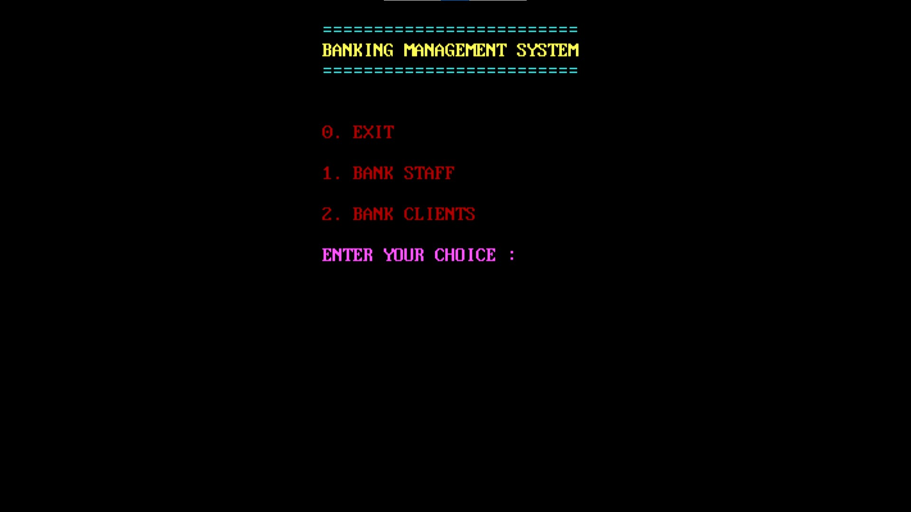

# Banking-Software
C++ Project for day-to-day staff and customer usage

### Overview
This is a high school project I made, deliberately picking Turbo-C++ to experience the challenges programmers faced earlier (and also because it looked cool and people thought I was 'hacker-man' when I typed into a blue window instead of a modern IDE).

For an image walkthrough of the project, go to the program-images folder and check out the screenshots

### To Run the Project
- Download Turbo C++ from https://developerinsider.co/download-turbo-c-for-windows-7-8-8-1-and-windows-10-32-64-bit-full-screen/
- Download NEWBANK.CPP or clone the repository using Git
- Copy the CPP file to install-path/TURBOC3/Projects
- Start Turbo C++ and open source file, run the project!
- Enjoy :)

